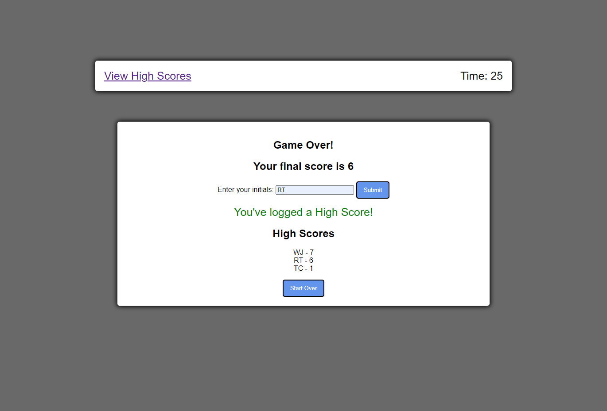

# javascript-knowledge-test

## Description

For this project, I have created a "JavaScript Knowledge Test" that will challenge the user to correctly answer the list of questions in the time allotted. This helps build memory retention about JavaScript with a bit of added pressure in a timed format. 

In creating this project, I learned about:

- JavaScript functions and their children
- Setting attributes with JavaScript
- How to set up a timer
- Logging data to local storage
- Using JSON to organize data in local storage

## Installation

All you need is a device with a browswer and internet access to use this page.

## Usage

For this game, you will be prompted to start the game at which point a 60 second timer will begin. For every wrong answer you get there is a deduction of 5 seconds. Once the timer runs out, or once you get through all the questions, it's Game Over!

Here is the link to the page: https://willj30.github.io/javascript-knowledge-test/

Screenshot:

## Credits

Here are some of the resources I used to complete this project:

https://simplestepscode.com/javascript-quiz-tutorial/

https://dev.to/codingnepal/create-a-quiz-app-with-timer-using-html-css-javascript-55lf

https://www.codingnepalweb.com/quiz-app-with-timer-javascript/

https://www.youtube.com/watch?v=riDzcEQbX6k

https://www.youtube.com/watch?v=f4fB9Xg2JEY

https://www.w3schools.com/jsref/met_loc_reload.asp

## License

MIT License
---